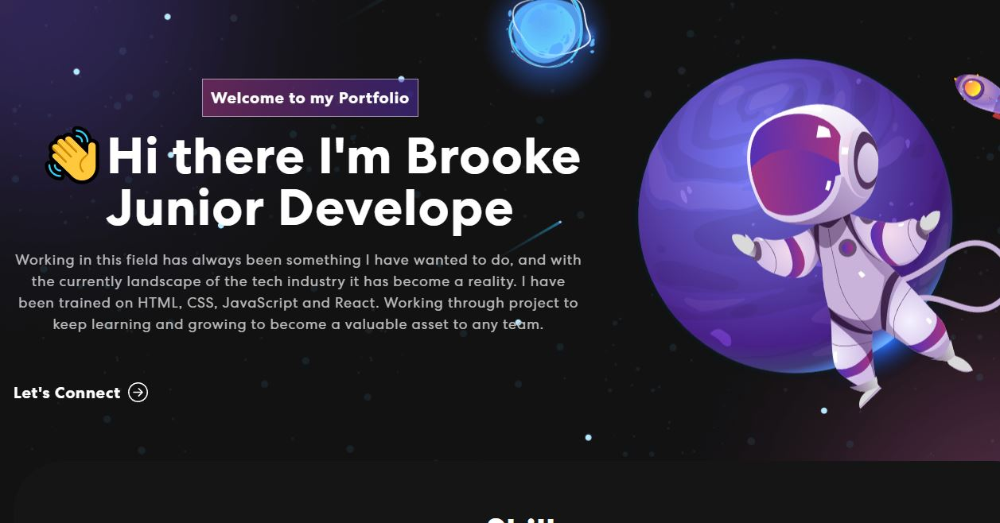

<p align="center">
  <a href="" rel="noopener">
 </a>
</p>

<h3 align="center">React Portfolio</h3>

<div align="center">

[]()

</div>

---

<p align="center"> This portfolio was created using React and JavaScript. I am using this portfolio to showcase my skills and projects I have been working on.
    <br> 
</p>

## 📝 Table of Contents

- [About](#about)
- [Getting Started](#getting_started)
- [Deployment](#deployment)
- [Usage](#usage)
- [Built Using](#built_using)
- [TODO](../TODO.md)
- [Contributing](../CONTRIBUTING.md)
- [Authors](#authors)
- [Acknowledgments](#acknowledgement)

## 🧐 About <a name = "about"></a>

This project was created to replace my first project with \_nology, which was a simple HTML and CSS portfolio. I then used React, Javascript and Bootstrap to make a much more professional portfolio. I wanted to make this portfolio to showcase my skills and projects that I have worked on.

## 🏁 Getting Started <a name = "getting_started"></a>

You can clone down this repo, and use npm start to see this repo on a live site. It is also being hosted on my GitHub pages.

### Prerequisites

To have this repo functioning correctly you need to open the terminal or cd into the folder on GitBash and type in npm install, to have all correct nodes and dependencies.

```
npm install
```

## 🎈 Usage <a name="usage"></a>

This project can be used as a template for your own portfolio, you can also clone it down, to see what my porfolio looks like.

## 🚀 Deployment <a name = "deployment"></a>

This repo is currently being deployed on my GitHub Pages.

## ⛏️ Built Using <a name = "built_using"></a>

- [React](https://reactjs.org/) - Web Framework
- [JavaScript](https://www.javascript.com/) - Code Language
- [BootStrap](https://react-bootstrap.github.io/) - React Library

## ✍️ Authors <a name = "authors"></a>

- [@BrookeVerse](https://github.com/BrookeVerse) - Idea & Initial work

## 🎉 Acknowledgements <a name = "acknowledgement"></a>

- A thank you to [@judygab](https://github.com/judygab) and her help on creating this portfolio.
